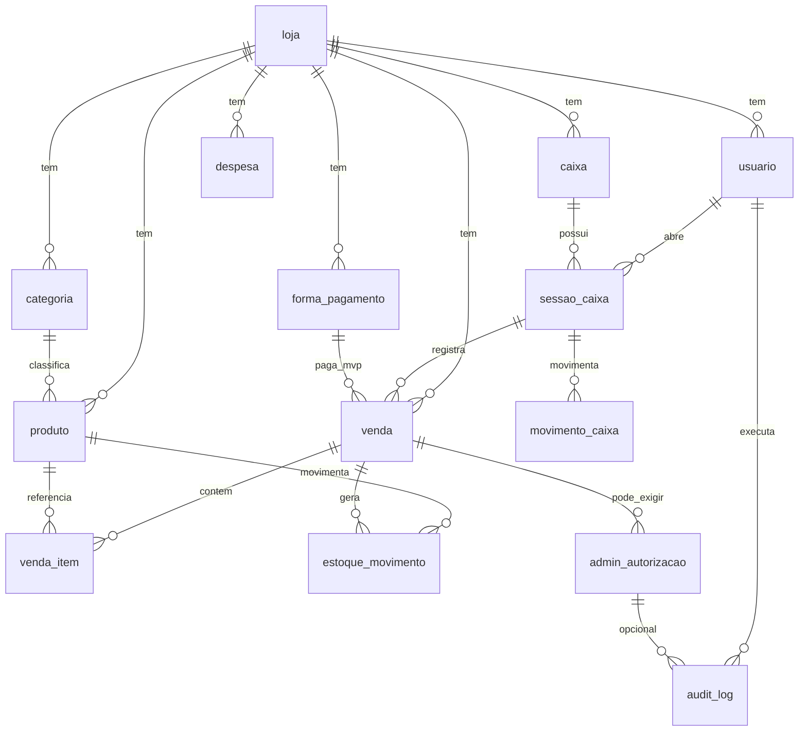

# Modelo de Dados — Hebil Store

Documento oficial do schema MySQL. Complementa [`requisitos-pt1.md`](requisitos-pt1.md), [`tecnologias.md`](tecnologias.md) e [`arquitetura.md`](arquitetura.md).

**SGBD:** MySQL 8.x · **Engine:** InnoDB · **Charset:** `utf8mb4_unicode_ci`

---

## 1. Convenções

### 1.1 Nomenclatura

| Elemento | Padrão | Exemplo |
|----------|--------|---------|
| Tabelas | `snake_case`, português | `sessao_caixa`, `venda_item` |
| Chaves primárias | `id` + PascalCase da entidade | `idLoja`, `idUsuario`, `idVenda` |
| Chaves estrangeiras | mesmo nome da PK referenciada | `idLoja`, `idSessaoCaixa` |
| Demais colunas | `snake_case` | `preco_venda`, `criado_em` |

### 1.2 Exclusão lógica e histórico

| Regra | Implementação |
|-------|----------------|
| Cadastros (loja, usuário, produto, etc.) | `status ENUM('Ativo','Inativo')` — **sem `DELETE`** |
| Venda | `situacao` — nunca apagar linha |
| Item de venda | `status` Ativo/Removido — linha permanece |
| `estoque_movimento`, `movimento_caixa` | **sem `DELETE`** — estorno = **novo** registro + `idReferenciaEstorno` |
| Auditoria | apenas `INSERT` em `audit_log` |

### 1.3 Tipos comuns

| Uso | Tipo MySQL |
|-----|------------|
| IDs | `BIGINT UNSIGNED` |
| Dinheiro | `DECIMAL(12,2)` |
| Quantidade estoque | `DECIMAL(12,3)` — aceita fracionado (peso); usar `INT` se a loja for só unidade inteira |
| Textos curtos | `VARCHAR` |
| Datas de negócio | `DATETIME` (padrão do app) ou `DATE` onde indicado |
| Snapshot JSON no log | `JSON` |

### 1.4 Multi-loja

Tabelas operacionais possuem `idLoja` (FK). No MVP pode existir apenas uma linha em `loja`.

### 1.5 Pagamentos (MVP vs fase 2)

| Fase | Modelo | Código |
|------|--------|--------|
| **MVP** | `venda.idFormaPagamento` + `venda.valor_total` | Strategy + Factory — ver [arquitetura §8](arquitetura.md#8-pagamentos--strategy--factory-código-não-substitui-o-banco) |
| **Fase 2** | Tabela `venda_pagamento` (split: dinheiro + PIX, etc.) | Mesmos handlers; loop por linha de pagamento |

---

## 2. Diagrama lógico



---

## 3. Tabelas — cadastros

### 3.1 `loja`

| Coluna | Tipo | Null | Descrição |
|--------|------|------|-----------|
| `idLoja` | BIGINT UNSIGNED | NO | PK |
| `nome` | VARCHAR(150) | NO | |
| `documento` | VARCHAR(20) | YES | CNPJ opcional |
| `status` | ENUM('Ativo','Inativo') | NO | Default `Ativo` |
| `criado_em` | DATETIME | NO | |
| `atualizado_em` | DATETIME | NO | |

**Índices:** PK (`idLoja`)

---

### 3.2 `usuario`

| Coluna | Tipo | Null | Descrição |
|--------|------|------|-----------|
| `idUsuario` | BIGINT UNSIGNED | NO | PK |
| `idLoja` | BIGINT UNSIGNED | NO | FK → `loja` |
| `nome` | VARCHAR(150) | NO | |
| `login` | VARCHAR(60) | NO | Único por loja |
| `email` | VARCHAR(180) | YES | |
| `senha_hash` | VARCHAR(255) | NO | bcrypt/argon |
| `tipo` | ENUM('Funcionario','Administrador') | NO | |
| `status` | ENUM('Ativo','Inativo') | NO | Default `Ativo` |
| `ultimo_login_em` | DATETIME | YES | |
| `criado_em` | DATETIME | NO | |
| `atualizado_em` | DATETIME | NO | |

**Índices:**

- PK (`idUsuario`)
- UNIQUE (`idLoja`, `login`)
- INDEX (`idLoja`, `status`)

**Symfony:** `Administrador` → `ROLE_ADMIN`; `Funcionario` → `ROLE_FUNCIONARIO`.

---

### 3.3 `categoria`

| Coluna | Tipo | Null | Descrição |
|--------|------|------|-----------|
| `idCategoria` | BIGINT UNSIGNED | NO | PK |
| `idLoja` | BIGINT UNSIGNED | NO | FK → `loja` |
| `nome` | VARCHAR(100) | NO | |
| `status` | ENUM('Ativo','Inativo') | NO | Default `Ativo` |
| `criado_em` | DATETIME | NO | |
| `atualizado_em` | DATETIME | NO | |

**Índices:** PK, INDEX (`idLoja`, `status`)

Filtro de relatórios por categoria (requisito).

---

### 3.4 `forma_pagamento`

| Coluna | Tipo | Null | Descrição |
|--------|------|------|-----------|
| `idFormaPagamento` | BIGINT UNSIGNED | NO | PK |
| `idLoja` | BIGINT UNSIGNED | NO | FK → `loja` |
| `nome` | VARCHAR(60) | NO | Ex.: Dinheiro, PIX |
| `codigo` | VARCHAR(30) | NO | Ex.: `dinheiro`, `pix` — chave da Factory |
| `afeta_caixa_fisico` | TINYINT(1) | NO | 1 = movimenta gaveta |
| `status` | ENUM('Ativo','Inativo') | NO | Default `Ativo` |
| `ordem` | SMALLINT UNSIGNED | NO | Ordem no PDV |
| `criado_em` | DATETIME | NO | |

**Índices:**

- PK
- UNIQUE (`idLoja`, `codigo`)

**Seed sugerido (MVP):** Dinheiro (`afeta_caixa_fisico=1`), PIX, Débito, Crédito.

---

### 3.5 `caixa`

Terminal / gaveta lógica (Caixa 1, Caixa 2).

| Coluna | Tipo | Null | Descrição |
|--------|------|------|-----------|
| `idCaixa` | BIGINT UNSIGNED | NO | PK |
| `idLoja` | BIGINT UNSIGNED | NO | FK → `loja` |
| `nome` | VARCHAR(80) | NO | |
| `identificador` | VARCHAR(50) | YES | Hostname / terminal |
| `status` | ENUM('Ativo','Inativo') | NO | Default `Ativo` |
| `criado_em` | DATETIME | NO | |
| `atualizado_em` | DATETIME | NO | |

**Índices:** PK, INDEX (`idLoja`, `status`)

---

### 3.6 `produto`

| Coluna | Tipo | Null | Descrição |
|--------|------|------|-----------|
| `idProduto` | BIGINT UNSIGNED | NO | PK |
| `idLoja` | BIGINT UNSIGNED | NO | FK → `loja` |
| `idCategoria` | BIGINT UNSIGNED | YES | FK → `categoria` |
| `nome` | VARCHAR(200) | NO | |
| `codigo_barras` | VARCHAR(32) | YES | UNIQUE por loja se preenchido |
| `sku` | VARCHAR(50) | YES | |
| `preco_venda` | DECIMAL(12,2) | NO | |
| `preco_custo` | DECIMAL(12,2) | NO | Consultas admin / lucro |
| `estoque_atual` | DECIMAL(12,3) | NO | Denormalizado; atualizado com movimento |
| `estoque_minimo` | DECIMAL(12,3) | NO | Default 0 — alerta |
| `unidade` | VARCHAR(10) | NO | Default `UN` |
| `status` | ENUM('Ativo','Inativo') | NO | Inativação sem DELETE |
| `criado_em` | DATETIME | NO | |
| `atualizado_em` | DATETIME | NO | |

**Índices:**

- PK
- UNIQUE (`idLoja`, `codigo_barras`) — MySQL permite múltiplos NULL em UNIQUE
- INDEX (`idLoja`, `status`)
- INDEX (`idLoja`, `nome`)

**PDV:** repositories de funcionário **não** selecionam `preco_custo`.

---

## 4. Tabelas — estoque

### 4.1 `estoque_movimento`

Livro-razão do estoque. **Somente INSERT** (+ estorno via novo registro).

| Coluna | Tipo | Null | Descrição |
|--------|------|------|-----------|
| `idEstoqueMovimento` | BIGINT UNSIGNED | NO | PK |
| `idLoja` | BIGINT UNSIGNED | NO | FK → `loja` |
| `idProduto` | BIGINT UNSIGNED | NO | FK → `produto` |
| `tipo` | ENUM('Entrada','SaidaVenda','Perda','Ajuste','EstornoVenda','EstornoAjuste') | NO | |
| `quantidade` | DECIMAL(12,3) | NO | Sempre **positivo**; sentido definido por `tipo` |
| `saldo_apos` | DECIMAL(12,3) | NO | Snapshot após movimento |
| `custo_unitario` | DECIMAL(12,2) | YES | |
| `idVenda` | BIGINT UNSIGNED | YES | FK → `venda` |
| `idVendaItem` | BIGINT UNSIGNED | YES | FK → `venda_item` |
| `idUsuario` | BIGINT UNSIGNED | NO | FK → `usuario` — responsável |
| `motivo` | VARCHAR(500) | YES | Obrigatório em Perda/Ajuste |
| `idAutorizacaoAdmin` | BIGINT UNSIGNED | YES | FK → `admin_autorizacao` |
| `idReferenciaEstorno` | BIGINT UNSIGNED | YES | FK → `estoque_movimento` |
| `criado_em` | DATETIME | NO | |

**Índices:** PK, INDEX (`idProduto`, `criado_em`), INDEX (`idVenda`), INDEX (`idLoja`, `criado_em`)

**Regra:** `EstoqueService` atualiza `produto.estoque_atual` na mesma transação do INSERT.

---

## 5. Tabelas — caixa

### 5.1 `sessao_caixa`

Um **turno** (abertura → fechamento) em um `caixa`.

| Coluna | Tipo | Null | Descrição |
|--------|------|------|-----------|
| `idSessaoCaixa` | BIGINT UNSIGNED | NO | PK |
| `idLoja` | BIGINT UNSIGNED | NO | FK → `loja` |
| `idCaixa` | BIGINT UNSIGNED | NO | FK → `caixa` |
| `idUsuario` | BIGINT UNSIGNED | NO | FK → `usuario` — quem abriu |
| `situacao` | ENUM('Aberta','Fechada') | NO | |
| `valor_abertura` | DECIMAL(12,2) | NO | Fundo de troco |
| `valor_fechamento_informado` | DECIMAL(12,2) | YES | Contado no fechamento |
| `valor_fechamento_sistema` | DECIMAL(12,2) | YES | Calculado |
| `divergencia` | DECIMAL(12,2) | YES | informado − sistema |
| `motivo_divergencia` | VARCHAR(500) | YES | Obrigatório se houver divergência |
| `aberta_em` | DATETIME | NO | |
| `fechada_em` | DATETIME | YES | |
| `idUsuarioFechamento` | BIGINT UNSIGNED | YES | FK → `usuario` |

**Índices:**

- PK
- INDEX (`idCaixa`, `situacao`)
- INDEX (`idLoja`, `aberta_em`)

**Regra de negócio:** no máximo **uma** sessão `Aberta` por `idCaixa` (validar na aplicação).

---

### 5.2 `movimento_caixa`

Movimentações financeiras da gaveta. **Sem DELETE.**

| Coluna | Tipo | Null | Descrição |
|--------|------|------|-----------|
| `idMovimentoCaixa` | BIGINT UNSIGNED | NO | PK |
| `idLoja` | BIGINT UNSIGNED | NO | FK → `loja` |
| `idSessaoCaixa` | BIGINT UNSIGNED | NO | FK → `sessao_caixa` |
| `tipo` | ENUM('Abertura','Venda','Sangria','Suprimento','AjusteEntrada','AjusteSaida','Fechamento','Estorno') | NO | |
| `natureza` | ENUM('Entrada','Saida') | NO | |
| `valor` | DECIMAL(12,2) | NO | Sempre positivo |
| `idVenda` | BIGINT UNSIGNED | YES | FK → `venda` |
| `idFormaPagamento` | BIGINT UNSIGNED | YES | FK → `forma_pagamento` |
| `idUsuario` | BIGINT UNSIGNED | NO | FK → `usuario` |
| `descricao` | VARCHAR(255) | YES | |
| `motivo` | VARCHAR(500) | YES | Sangria, suprimento, etc. |
| `idReferenciaEstorno` | BIGINT UNSIGNED | YES | FK → `movimento_caixa` |
| `idAutorizacaoAdmin` | BIGINT UNSIGNED | YES | FK → `admin_autorizacao` |
| `criado_em` | DATETIME | NO | |

**Índices:** PK, INDEX (`idSessaoCaixa`, `criado_em`), INDEX (`idVenda`)

**MVP:** `DinheiroHandler` (Strategy) gera movimento `tipo=Venda`, `natureza=Entrada` quando `afeta_caixa_fisico=1`.

---

## 6. Tabelas — vendas (PDV)

### 6.1 `venda`

| Coluna | Tipo | Null | Descrição |
|--------|------|------|-----------|
| `idVenda` | BIGINT UNSIGNED | NO | PK |
| `idLoja` | BIGINT UNSIGNED | NO | FK → `loja` |
| `numero` | INT UNSIGNED | NO | Sequencial por loja |
| `idSessaoCaixa` | BIGINT UNSIGNED | NO | FK → `sessao_caixa` |
| `idCaixa` | BIGINT UNSIGNED | NO | FK → `caixa` — desnormalizado para relatório |
| `idUsuario` | BIGINT UNSIGNED | NO | FK → `usuario` — operador |
| `situacao` | ENUM('Aberta','Finalizada','Cancelada') | NO | |
| `subtotal` | DECIMAL(12,2) | NO | Default 0 |
| `desconto_valor` | DECIMAL(12,2) | NO | Default 0 — desconto no total |
| `desconto_percentual` | DECIMAL(5,2) | YES | |
| `valor_total` | DECIMAL(12,2) | NO | Default 0 |
| `idFormaPagamento` | BIGINT UNSIGNED | YES | FK → `forma_pagamento` — **MVP: pagamento único** |
| `observacao` | VARCHAR(500) | YES | |
| `motivo_cancelamento` | VARCHAR(500) | YES | |
| `idUsuarioCancelamento` | BIGINT UNSIGNED | YES | FK → `usuario` |
| `idAutorizacaoAdminCancelamento` | BIGINT UNSIGNED | YES | FK → `admin_autorizacao` |
| `finalizada_em` | DATETIME | YES | |
| `cancelada_em` | DATETIME | YES | |
| `criado_em` | DATETIME | NO | |
| `atualizado_em` | DATETIME | NO | |

**Índices:**

- PK
- UNIQUE (`idLoja`, `numero`)
- INDEX (`idLoja`, `situacao`, `criado_em`)
- INDEX (`idUsuario`, `finalizada_em`)
- INDEX (`idSessaoCaixa`)

**Regras:**

- Venda cancelada permanece (`situacao = Cancelada`).
- `idFormaPagamento` preenchido na finalização (MVP).

---

### 6.2 `venda_item`

| Coluna | Tipo | Null | Descrição |
|--------|------|------|-----------|
| `idVendaItem` | BIGINT UNSIGNED | NO | PK |
| `idVenda` | BIGINT UNSIGNED | NO | FK → `venda` |
| `idProduto` | BIGINT UNSIGNED | NO | FK → `produto` |
| `ordem` | SMALLINT UNSIGNED | NO | Linha no cupom |
| `status` | ENUM('Ativo','Removido') | NO | Default `Ativo` |
| `quantidade` | DECIMAL(12,3) | NO | |
| `preco_unitario` | DECIMAL(12,2) | NO | Snapshot na inclusão |
| `custo_unitario` | DECIMAL(12,2) | NO | Snapshot — lucro (admin) |
| `desconto_valor` | DECIMAL(12,2) | NO | Default 0 |
| `subtotal` | DECIMAL(12,2) | NO | |
| `total` | DECIMAL(12,2) | NO | |
| `motivo_remocao` | VARCHAR(500) | YES | |
| `idUsuarioRemocao` | BIGINT UNSIGNED | YES | FK → `usuario` |
| `idAutorizacaoAdminRemocao` | BIGINT UNSIGNED | YES | FK → `admin_autorizacao` |
| `removido_em` | DATETIME | YES | |
| `criado_em` | DATETIME | NO | |

**Índices:** PK, INDEX (`idVenda`, `status`), INDEX (`idProduto`)

---

### 6.3 `venda_pagamento` — **Fase 2**

Pagamento dividido (ex.: parte dinheiro, parte PIX). **Não criar no MVP.**

| Coluna | Tipo | Null | Descrição |
|--------|------|------|-----------|
| `idVendaPagamento` | BIGINT UNSIGNED | NO | PK |
| `idVenda` | BIGINT UNSIGNED | NO | FK → `venda` |
| `idFormaPagamento` | BIGINT UNSIGNED | NO | FK → `forma_pagamento` |
| `valor` | DECIMAL(12,2) | NO | |
| `referencia_externa` | VARCHAR(100) | YES | NSU, etc. |
| `criado_em` | DATETIME | NO | |

**Índices:** PK, INDEX (`idVenda`)

**Migração fase 2:** popular `venda_pagamento` a partir de vendas antigas; `venda.idFormaPagamento` pode tornar-se opcional ou depreciado.

---

## 7. Tabelas — financeiro admin

### 7.1 `despesa`

Lançamentos para dashboard (despesas, lucro líquido).

| Coluna | Tipo | Null | Descrição |
|--------|------|------|-----------|
| `idDespesa` | BIGINT UNSIGNED | NO | PK |
| `idLoja` | BIGINT UNSIGNED | NO | FK → `loja` |
| `descricao` | VARCHAR(255) | NO | |
| `valor` | DECIMAL(12,2) | NO | |
| `data_competencia` | DATE | NO | |
| `categoria_despesa` | VARCHAR(80) | YES | |
| `idUsuario` | BIGINT UNSIGNED | NO | FK → `usuario` |
| `status` | ENUM('Ativo','Inativo') | NO | Cancelamento lógico |
| `criado_em` | DATETIME | NO | |
| `atualizado_em` | DATETIME | NO | |

**Índices:** PK, INDEX (`idLoja`, `data_competencia`)

---

## 8. Tabelas — auditoria

### 8.1 `admin_autorizacao`

Registro quando funcionário precisa de **senha/admin** (cancelamento, remoção de item, desconto crítico, etc.).

| Coluna | Tipo | Null | Descrição |
|--------|------|------|-----------|
| `idAutorizacaoAdmin` | BIGINT UNSIGNED | NO | PK |
| `idLoja` | BIGINT UNSIGNED | NO | FK → `loja` |
| `codigo_operacao` | VARCHAR(60) | NO | Ex.: `venda.cancelar`, `venda_item.remover` |
| `entidade` | VARCHAR(60) | NO | Ex.: `venda`, `venda_item` |
| `idEntidade` | BIGINT UNSIGNED | NO | ID genérico da entidade |
| `idUsuarioSolicitante` | BIGINT UNSIGNED | NO | FK → `usuario` |
| `idUsuarioAutorizador` | BIGINT UNSIGNED | NO | FK → `usuario` — admin |
| `autorizado` | TINYINT(1) | NO | 1 = ok, 0 = negado |
| `motivo` | VARCHAR(500) | YES | |
| `ip` | VARCHAR(45) | YES | |
| `terminal` | VARCHAR(100) | YES | |
| `criado_em` | DATETIME | NO | |

**Índices:** PK, INDEX (`idLoja`, `criado_em`), INDEX (`entidade`, `idEntidade`)

---

### 8.2 `audit_log`

Trilha de auditoria geral (requisito: usuário, data, ação, antes/depois, motivo).

| Coluna | Tipo | Null | Descrição |
|--------|------|------|-----------|
| `idAuditLog` | BIGINT UNSIGNED | NO | PK |
| `idLoja` | BIGINT UNSIGNED | YES | FK → `loja` |
| `idUsuario` | BIGINT UNSIGNED | YES | FK → `usuario` — NULL se sistema |
| `acao` | VARCHAR(80) | NO | Ex.: `login`, `venda.finalizada` |
| `entidade` | VARCHAR(60) | YES | |
| `idEntidade` | BIGINT UNSIGNED | YES | |
| `valor_anterior` | JSON | YES | |
| `valor_atual` | JSON | YES | |
| `motivo` | VARCHAR(500) | YES | |
| `ip` | VARCHAR(45) | YES | |
| `terminal` | VARCHAR(100) | YES | |
| `idAutorizacaoAdmin` | BIGINT UNSIGNED | YES | FK → `admin_autorizacao` |
| `criado_em` | DATETIME | NO | |

**Índices:**

- PK
- INDEX (`idLoja`, `criado_em`)
- INDEX (`entidade`, `idEntidade`)
- INDEX (`idUsuario`, `criado_em`)

**Somente INSERT** — sem UPDATE/DELETE.

---

## 9. Infraestrutura

### 9.1 `schema_version`

Controle de migrations SQL manuais.

| Coluna | Tipo | Null | Descrição |
|--------|------|------|-----------|
| `versao` | VARCHAR(20) | NO | PK — ex.: `V001` |
| `descricao` | VARCHAR(255) | YES | |
| `aplicada_em` | DATETIME | NO | |

---

## 10. Mapa módulo → tabela

| Módulo (`src/Module/`) | Tabelas |
|------------------------|---------|
| Auth / Usuario | `loja`, `usuario` |
| Produto | `produto`, `categoria` |
| Estoque | `estoque_movimento` (+ `produto.estoque_atual`) |
| Venda | `venda`, `venda_item` — fase 2: `venda_pagamento` |
| Caixa | `caixa`, `sessao_caixa`, `movimento_caixa` |
| Dashboard / Relatorio | leitura nas tabelas acima + `despesa` |
| Auditoria | `audit_log`, `admin_autorizacao` |

---

## 11. Enums — referência rápida

| Tabela | Coluna | Valores |
|--------|--------|---------|
| `loja`, `usuario`, `produto`, `categoria`, `forma_pagamento`, `caixa`, `despesa` | `status` | `Ativo`, `Inativo` |
| `usuario` | `tipo` | `Funcionario`, `Administrador` |
| `venda` | `situacao` | `Aberta`, `Finalizada`, `Cancelada` |
| `venda_item` | `status` | `Ativo`, `Removido` |
| `sessao_caixa` | `situacao` | `Aberta`, `Fechada` |
| `estoque_movimento` | `tipo` | `Entrada`, `SaidaVenda`, `Perda`, `Ajuste`, `EstornoVenda`, `EstornoAjuste` |
| `movimento_caixa` | `tipo` | `Abertura`, `Venda`, `Sangria`, `Suprimento`, `AjusteEntrada`, `AjusteSaida`, `Fechamento`, `Estorno` |
| `movimento_caixa` | `natureza` | `Entrada`, `Saida` |

---

## 12. Fluxos × tabelas

| Fluxo | Tabelas |
|-------|---------|
| Login | `usuario` → `audit_log` |
| Abrir caixa | `sessao_caixa`, `movimento_caixa` (Abertura) |
| Iniciar venda | `venda` (`situacao=Aberta`) |
| Adicionar item | `venda_item` (snapshots de preço/custo) |
| Remover item (com admin) | `admin_autorizacao`, `venda_item.status=Removido`, `audit_log` |
| Finalizar venda (MVP) | `venda` + `idFormaPagamento`, `estoque_movimento`, `movimento_caixa`, `audit_log` |
| Cancelar venda | `venda.situacao=Cancelada`, estornos, `admin_autorizacao`, `audit_log` |
| Ajuste estoque | `estoque_movimento`, `produto.estoque_atual` |
| Fechar caixa | `sessao_caixa` (Fechada), divergência, `audit_log` |
| Lucro (admin) | `venda_item` (preco − custo snapshot) − `despesa` |

---

## 13. DDL de referência — MVP (`V001`)

Arquivo sugerido: `database/migrations/V001__schema_mvp.sql`

```sql
-- V001 — Schema MVP Hebil Store
-- Convenção: PK idEntidade (camelCase), demais colunas snake_case

CREATE TABLE loja (
    idLoja BIGINT UNSIGNED NOT NULL AUTO_INCREMENT,
    nome VARCHAR(150) NOT NULL,
    documento VARCHAR(20) NULL,
    status ENUM('Ativo','Inativo') NOT NULL DEFAULT 'Ativo',
    criado_em DATETIME NOT NULL,
    atualizado_em DATETIME NOT NULL,
    PRIMARY KEY (idLoja)
) ENGINE=InnoDB DEFAULT CHARSET=utf8mb4 COLLATE=utf8mb4_unicode_ci;

CREATE TABLE usuario (
    idUsuario BIGINT UNSIGNED NOT NULL AUTO_INCREMENT,
    idLoja BIGINT UNSIGNED NOT NULL,
    nome VARCHAR(150) NOT NULL,
    login VARCHAR(60) NOT NULL,
    email VARCHAR(180) NULL,
    senha_hash VARCHAR(255) NOT NULL,
    tipo ENUM('Funcionario','Administrador') NOT NULL,
    status ENUM('Ativo','Inativo') NOT NULL DEFAULT 'Ativo',
    ultimo_login_em DATETIME NULL,
    criado_em DATETIME NOT NULL,
    atualizado_em DATETIME NOT NULL,
    PRIMARY KEY (idUsuario),
    UNIQUE KEY uk_usuario_loja_login (idLoja, login),
    KEY idx_usuario_loja_status (idLoja, status),
    CONSTRAINT fk_usuario_loja FOREIGN KEY (idLoja) REFERENCES loja (idLoja)
) ENGINE=InnoDB DEFAULT CHARSET=utf8mb4 COLLATE=utf8mb4_unicode_ci;

CREATE TABLE categoria (
    idCategoria BIGINT UNSIGNED NOT NULL AUTO_INCREMENT,
    idLoja BIGINT UNSIGNED NOT NULL,
    nome VARCHAR(100) NOT NULL,
    status ENUM('Ativo','Inativo') NOT NULL DEFAULT 'Ativo',
    criado_em DATETIME NOT NULL,
    atualizado_em DATETIME NOT NULL,
    PRIMARY KEY (idCategoria),
    KEY idx_categoria_loja_status (idLoja, status),
    CONSTRAINT fk_categoria_loja FOREIGN KEY (idLoja) REFERENCES loja (idLoja)
) ENGINE=InnoDB DEFAULT CHARSET=utf8mb4 COLLATE=utf8mb4_unicode_ci;

CREATE TABLE forma_pagamento (
    idFormaPagamento BIGINT UNSIGNED NOT NULL AUTO_INCREMENT,
    idLoja BIGINT UNSIGNED NOT NULL,
    nome VARCHAR(60) NOT NULL,
    codigo VARCHAR(30) NOT NULL,
    afeta_caixa_fisico TINYINT(1) NOT NULL DEFAULT 0,
    status ENUM('Ativo','Inativo') NOT NULL DEFAULT 'Ativo',
    ordem SMALLINT UNSIGNED NOT NULL DEFAULT 0,
    criado_em DATETIME NOT NULL,
    PRIMARY KEY (idFormaPagamento),
    UNIQUE KEY uk_forma_loja_codigo (idLoja, codigo),
    CONSTRAINT fk_forma_loja FOREIGN KEY (idLoja) REFERENCES loja (idLoja)
) ENGINE=InnoDB DEFAULT CHARSET=utf8mb4 COLLATE=utf8mb4_unicode_ci;

CREATE TABLE caixa (
    idCaixa BIGINT UNSIGNED NOT NULL AUTO_INCREMENT,
    idLoja BIGINT UNSIGNED NOT NULL,
    nome VARCHAR(80) NOT NULL,
    identificador VARCHAR(50) NULL,
    status ENUM('Ativo','Inativo') NOT NULL DEFAULT 'Ativo',
    criado_em DATETIME NOT NULL,
    atualizado_em DATETIME NOT NULL,
    PRIMARY KEY (idCaixa),
    KEY idx_caixa_loja_status (idLoja, status),
    CONSTRAINT fk_caixa_loja FOREIGN KEY (idLoja) REFERENCES loja (idLoja)
) ENGINE=InnoDB DEFAULT CHARSET=utf8mb4 COLLATE=utf8mb4_unicode_ci;

CREATE TABLE produto (
    idProduto BIGINT UNSIGNED NOT NULL AUTO_INCREMENT,
    idLoja BIGINT UNSIGNED NOT NULL,
    idCategoria BIGINT UNSIGNED NULL,
    nome VARCHAR(200) NOT NULL,
    codigo_barras VARCHAR(32) NULL,
    sku VARCHAR(50) NULL,
    preco_venda DECIMAL(12,2) NOT NULL,
    preco_custo DECIMAL(12,2) NOT NULL DEFAULT 0.00,
    estoque_atual DECIMAL(12,3) NOT NULL DEFAULT 0.000,
    estoque_minimo DECIMAL(12,3) NOT NULL DEFAULT 0.000,
    unidade VARCHAR(10) NOT NULL DEFAULT 'UN',
    status ENUM('Ativo','Inativo') NOT NULL DEFAULT 'Ativo',
    criado_em DATETIME NOT NULL,
    atualizado_em DATETIME NOT NULL,
    PRIMARY KEY (idProduto),
    UNIQUE KEY uk_produto_loja_barcode (idLoja, codigo_barras),
    KEY idx_produto_loja_status (idLoja, status),
    KEY idx_produto_loja_nome (idLoja, nome),
    CONSTRAINT fk_produto_loja FOREIGN KEY (idLoja) REFERENCES loja (idLoja),
    CONSTRAINT fk_produto_categoria FOREIGN KEY (idCategoria) REFERENCES categoria (idCategoria)
) ENGINE=InnoDB DEFAULT CHARSET=utf8mb4 COLLATE=utf8mb4_unicode_ci;

CREATE TABLE admin_autorizacao (
    idAutorizacaoAdmin BIGINT UNSIGNED NOT NULL AUTO_INCREMENT,
    idLoja BIGINT UNSIGNED NOT NULL,
    codigo_operacao VARCHAR(60) NOT NULL,
    entidade VARCHAR(60) NOT NULL,
    idEntidade BIGINT UNSIGNED NOT NULL,
    idUsuarioSolicitante BIGINT UNSIGNED NOT NULL,
    idUsuarioAutorizador BIGINT UNSIGNED NOT NULL,
    autorizado TINYINT(1) NOT NULL,
    motivo VARCHAR(500) NULL,
    ip VARCHAR(45) NULL,
    terminal VARCHAR(100) NULL,
    criado_em DATETIME NOT NULL,
    PRIMARY KEY (idAutorizacaoAdmin),
    KEY idx_auth_loja_criado (idLoja, criado_em),
    KEY idx_auth_entidade (entidade, idEntidade),
    CONSTRAINT fk_auth_loja FOREIGN KEY (idLoja) REFERENCES loja (idLoja),
    CONSTRAINT fk_auth_solicitante FOREIGN KEY (idUsuarioSolicitante) REFERENCES usuario (idUsuario),
    CONSTRAINT fk_auth_autorizador FOREIGN KEY (idUsuarioAutorizador) REFERENCES usuario (idUsuario)
) ENGINE=InnoDB DEFAULT CHARSET=utf8mb4 COLLATE=utf8mb4_unicode_ci;

CREATE TABLE sessao_caixa (
    idSessaoCaixa BIGINT UNSIGNED NOT NULL AUTO_INCREMENT,
    idLoja BIGINT UNSIGNED NOT NULL,
    idCaixa BIGINT UNSIGNED NOT NULL,
    idUsuario BIGINT UNSIGNED NOT NULL,
    situacao ENUM('Aberta','Fechada') NOT NULL DEFAULT 'Aberta',
    valor_abertura DECIMAL(12,2) NOT NULL,
    valor_fechamento_informado DECIMAL(12,2) NULL,
    valor_fechamento_sistema DECIMAL(12,2) NULL,
    divergencia DECIMAL(12,2) NULL,
    motivo_divergencia VARCHAR(500) NULL,
    aberta_em DATETIME NOT NULL,
    fechada_em DATETIME NULL,
    idUsuarioFechamento BIGINT UNSIGNED NULL,
    PRIMARY KEY (idSessaoCaixa),
    KEY idx_sessao_caixa_situacao (idCaixa, situacao),
    KEY idx_sessao_loja_aberta (idLoja, aberta_em),
    CONSTRAINT fk_sessao_loja FOREIGN KEY (idLoja) REFERENCES loja (idLoja),
    CONSTRAINT fk_sessao_caixa FOREIGN KEY (idCaixa) REFERENCES caixa (idCaixa),
    CONSTRAINT fk_sessao_usuario FOREIGN KEY (idUsuario) REFERENCES usuario (idUsuario),
    CONSTRAINT fk_sessao_usuario_fechamento FOREIGN KEY (idUsuarioFechamento) REFERENCES usuario (idUsuario)
) ENGINE=InnoDB DEFAULT CHARSET=utf8mb4 COLLATE=utf8mb4_unicode_ci;

CREATE TABLE venda (
    idVenda BIGINT UNSIGNED NOT NULL AUTO_INCREMENT,
    idLoja BIGINT UNSIGNED NOT NULL,
    numero INT UNSIGNED NOT NULL,
    idSessaoCaixa BIGINT UNSIGNED NOT NULL,
    idCaixa BIGINT UNSIGNED NOT NULL,
    idUsuario BIGINT UNSIGNED NOT NULL,
    situacao ENUM('Aberta','Finalizada','Cancelada') NOT NULL DEFAULT 'Aberta',
    subtotal DECIMAL(12,2) NOT NULL DEFAULT 0.00,
    desconto_valor DECIMAL(12,2) NOT NULL DEFAULT 0.00,
    desconto_percentual DECIMAL(5,2) NULL,
    valor_total DECIMAL(12,2) NOT NULL DEFAULT 0.00,
    idFormaPagamento BIGINT UNSIGNED NULL,
    observacao VARCHAR(500) NULL,
    motivo_cancelamento VARCHAR(500) NULL,
    idUsuarioCancelamento BIGINT UNSIGNED NULL,
    idAutorizacaoAdminCancelamento BIGINT UNSIGNED NULL,
    finalizada_em DATETIME NULL,
    cancelada_em DATETIME NULL,
    criado_em DATETIME NOT NULL,
    atualizado_em DATETIME NOT NULL,
    PRIMARY KEY (idVenda),
    UNIQUE KEY uk_venda_loja_numero (idLoja, numero),
    KEY idx_venda_loja_situacao (idLoja, situacao, criado_em),
    CONSTRAINT fk_venda_loja FOREIGN KEY (idLoja) REFERENCES loja (idLoja),
    CONSTRAINT fk_venda_sessao FOREIGN KEY (idSessaoCaixa) REFERENCES sessao_caixa (idSessaoCaixa),
    CONSTRAINT fk_venda_caixa FOREIGN KEY (idCaixa) REFERENCES caixa (idCaixa),
    CONSTRAINT fk_venda_usuario FOREIGN KEY (idUsuario) REFERENCES usuario (idUsuario),
    CONSTRAINT fk_venda_forma FOREIGN KEY (idFormaPagamento) REFERENCES forma_pagamento (idFormaPagamento),
    CONSTRAINT fk_venda_auth_cancel FOREIGN KEY (idAutorizacaoAdminCancelamento) REFERENCES admin_autorizacao (idAutorizacaoAdmin)
) ENGINE=InnoDB DEFAULT CHARSET=utf8mb4 COLLATE=utf8mb4_unicode_ci;

CREATE TABLE venda_item (
    idVendaItem BIGINT UNSIGNED NOT NULL AUTO_INCREMENT,
    idVenda BIGINT UNSIGNED NOT NULL,
    idProduto BIGINT UNSIGNED NOT NULL,
    ordem SMALLINT UNSIGNED NOT NULL,
    status ENUM('Ativo','Removido') NOT NULL DEFAULT 'Ativo',
    quantidade DECIMAL(12,3) NOT NULL,
    preco_unitario DECIMAL(12,2) NOT NULL,
    custo_unitario DECIMAL(12,2) NOT NULL,
    desconto_valor DECIMAL(12,2) NOT NULL DEFAULT 0.00,
    subtotal DECIMAL(12,2) NOT NULL,
    total DECIMAL(12,2) NOT NULL,
    motivo_remocao VARCHAR(500) NULL,
    idUsuarioRemocao BIGINT UNSIGNED NULL,
    idAutorizacaoAdminRemocao BIGINT UNSIGNED NULL,
    removido_em DATETIME NULL,
    criado_em DATETIME NOT NULL,
    PRIMARY KEY (idVendaItem),
    KEY idx_venda_item_venda (idVenda, status),
    CONSTRAINT fk_venda_item_venda FOREIGN KEY (idVenda) REFERENCES venda (idVenda),
    CONSTRAINT fk_venda_item_produto FOREIGN KEY (idProduto) REFERENCES produto (idProduto),
    CONSTRAINT fk_venda_item_auth FOREIGN KEY (idAutorizacaoAdminRemocao) REFERENCES admin_autorizacao (idAutorizacaoAdmin)
) ENGINE=InnoDB DEFAULT CHARSET=utf8mb4 COLLATE=utf8mb4_unicode_ci;

CREATE TABLE estoque_movimento (
    idEstoqueMovimento BIGINT UNSIGNED NOT NULL AUTO_INCREMENT,
    idLoja BIGINT UNSIGNED NOT NULL,
    idProduto BIGINT UNSIGNED NOT NULL,
    tipo ENUM('Entrada','SaidaVenda','Perda','Ajuste','EstornoVenda','EstornoAjuste') NOT NULL,
    quantidade DECIMAL(12,3) NOT NULL,
    saldo_apos DECIMAL(12,3) NOT NULL,
    custo_unitario DECIMAL(12,2) NULL,
    idVenda BIGINT UNSIGNED NULL,
    idVendaItem BIGINT UNSIGNED NULL,
    idUsuario BIGINT UNSIGNED NOT NULL,
    motivo VARCHAR(500) NULL,
    idAutorizacaoAdmin BIGINT UNSIGNED NULL,
    idReferenciaEstorno BIGINT UNSIGNED NULL,
    criado_em DATETIME NOT NULL,
    PRIMARY KEY (idEstoqueMovimento),
    KEY idx_estoque_produto (idProduto, criado_em),
    CONSTRAINT fk_estoque_loja FOREIGN KEY (idLoja) REFERENCES loja (idLoja),
    CONSTRAINT fk_estoque_produto FOREIGN KEY (idProduto) REFERENCES produto (idProduto),
    CONSTRAINT fk_estoque_venda FOREIGN KEY (idVenda) REFERENCES venda (idVenda),
    CONSTRAINT fk_estoque_venda_item FOREIGN KEY (idVendaItem) REFERENCES venda_item (idVendaItem),
    CONSTRAINT fk_estoque_usuario FOREIGN KEY (idUsuario) REFERENCES usuario (idUsuario),
    CONSTRAINT fk_estoque_auth FOREIGN KEY (idAutorizacaoAdmin) REFERENCES admin_autorizacao (idAutorizacaoAdmin),
    CONSTRAINT fk_estoque_ref_estorno FOREIGN KEY (idReferenciaEstorno) REFERENCES estoque_movimento (idEstoqueMovimento)
) ENGINE=InnoDB DEFAULT CHARSET=utf8mb4 COLLATE=utf8mb4_unicode_ci;

CREATE TABLE movimento_caixa (
    idMovimentoCaixa BIGINT UNSIGNED NOT NULL AUTO_INCREMENT,
    idLoja BIGINT UNSIGNED NOT NULL,
    idSessaoCaixa BIGINT UNSIGNED NOT NULL,
    tipo ENUM('Abertura','Venda','Sangria','Suprimento','AjusteEntrada','AjusteSaida','Fechamento','Estorno') NOT NULL,
    natureza ENUM('Entrada','Saida') NOT NULL,
    valor DECIMAL(12,2) NOT NULL,
    idVenda BIGINT UNSIGNED NULL,
    idFormaPagamento BIGINT UNSIGNED NULL,
    idUsuario BIGINT UNSIGNED NOT NULL,
    descricao VARCHAR(255) NULL,
    motivo VARCHAR(500) NULL,
    idReferenciaEstorno BIGINT UNSIGNED NULL,
    idAutorizacaoAdmin BIGINT UNSIGNED NULL,
    criado_em DATETIME NOT NULL,
    PRIMARY KEY (idMovimentoCaixa),
    KEY idx_mov_caixa_sessao (idSessaoCaixa, criado_em),
    CONSTRAINT fk_mov_loja FOREIGN KEY (idLoja) REFERENCES loja (idLoja),
    CONSTRAINT fk_mov_sessao FOREIGN KEY (idSessaoCaixa) REFERENCES sessao_caixa (idSessaoCaixa),
    CONSTRAINT fk_mov_venda FOREIGN KEY (idVenda) REFERENCES venda (idVenda),
    CONSTRAINT fk_mov_forma FOREIGN KEY (idFormaPagamento) REFERENCES forma_pagamento (idFormaPagamento),
    CONSTRAINT fk_mov_usuario FOREIGN KEY (idUsuario) REFERENCES usuario (idUsuario),
    CONSTRAINT fk_mov_auth FOREIGN KEY (idAutorizacaoAdmin) REFERENCES admin_autorizacao (idAutorizacaoAdmin),
    CONSTRAINT fk_mov_ref_estorno FOREIGN KEY (idReferenciaEstorno) REFERENCES movimento_caixa (idMovimentoCaixa)
) ENGINE=InnoDB DEFAULT CHARSET=utf8mb4 COLLATE=utf8mb4_unicode_ci;

CREATE TABLE despesa (
    idDespesa BIGINT UNSIGNED NOT NULL AUTO_INCREMENT,
    idLoja BIGINT UNSIGNED NOT NULL,
    descricao VARCHAR(255) NOT NULL,
    valor DECIMAL(12,2) NOT NULL,
    data_competencia DATE NOT NULL,
    categoria_despesa VARCHAR(80) NULL,
    idUsuario BIGINT UNSIGNED NOT NULL,
    status ENUM('Ativo','Inativo') NOT NULL DEFAULT 'Ativo',
    criado_em DATETIME NOT NULL,
    atualizado_em DATETIME NOT NULL,
    PRIMARY KEY (idDespesa),
    KEY idx_despesa_loja_data (idLoja, data_competencia),
    CONSTRAINT fk_despesa_loja FOREIGN KEY (idLoja) REFERENCES loja (idLoja),
    CONSTRAINT fk_despesa_usuario FOREIGN KEY (idUsuario) REFERENCES usuario (idUsuario)
) ENGINE=InnoDB DEFAULT CHARSET=utf8mb4 COLLATE=utf8mb4_unicode_ci;

CREATE TABLE audit_log (
    idAuditLog BIGINT UNSIGNED NOT NULL AUTO_INCREMENT,
    idLoja BIGINT UNSIGNED NULL,
    idUsuario BIGINT UNSIGNED NULL,
    acao VARCHAR(80) NOT NULL,
    entidade VARCHAR(60) NULL,
    idEntidade BIGINT UNSIGNED NULL,
    valor_anterior JSON NULL,
    valor_atual JSON NULL,
    motivo VARCHAR(500) NULL,
    ip VARCHAR(45) NULL,
    terminal VARCHAR(100) NULL,
    idAutorizacaoAdmin BIGINT UNSIGNED NULL,
    criado_em DATETIME NOT NULL,
    PRIMARY KEY (idAuditLog),
    KEY idx_audit_loja_criado (idLoja, criado_em),
    KEY idx_audit_entidade (entidade, idEntidade),
    CONSTRAINT fk_audit_loja FOREIGN KEY (idLoja) REFERENCES loja (idLoja),
    CONSTRAINT fk_audit_usuario FOREIGN KEY (idUsuario) REFERENCES usuario (idUsuario),
    CONSTRAINT fk_audit_auth FOREIGN KEY (idAutorizacaoAdmin) REFERENCES admin_autorizacao (idAutorizacaoAdmin)
) ENGINE=InnoDB DEFAULT CHARSET=utf8mb4 COLLATE=utf8mb4_unicode_ci;

CREATE TABLE schema_version (
    versao VARCHAR(20) NOT NULL,
    descricao VARCHAR(255) NULL,
    aplicada_em DATETIME NOT NULL,
    PRIMARY KEY (versao)
) ENGINE=InnoDB DEFAULT CHARSET=utf8mb4 COLLATE=utf8mb4_unicode_ci;

INSERT INTO schema_version (versao, descricao, aplicada_em)
VALUES ('V001', 'Schema MVP inicial', NOW());
```

---

## 14. DDL — Fase 2 (`V002`)

Arquivo sugerido: `database/migrations/V002__venda_pagamento.sql`

```sql
CREATE TABLE venda_pagamento (
    idVendaPagamento BIGINT UNSIGNED NOT NULL AUTO_INCREMENT,
    idVenda BIGINT UNSIGNED NOT NULL,
    idFormaPagamento BIGINT UNSIGNED NOT NULL,
    valor DECIMAL(12,2) NOT NULL,
    referencia_externa VARCHAR(100) NULL,
    criado_em DATETIME NOT NULL,
    PRIMARY KEY (idVendaPagamento),
    KEY idx_venda_pagamento_venda (idVenda),
    CONSTRAINT fk_vp_venda FOREIGN KEY (idVenda) REFERENCES venda (idVenda),
    CONSTRAINT fk_vp_forma FOREIGN KEY (idFormaPagamento) REFERENCES forma_pagamento (idFormaPagamento)
) ENGINE=InnoDB DEFAULT CHARSET=utf8mb4 COLLATE=utf8mb4_unicode_ci;

INSERT INTO schema_version (versao, descricao, aplicada_em)
VALUES ('V002', 'Pagamento dividido na venda', NOW());
```

---

## 15. Próximos documentos

| Documento | Conteúdo |
|-----------|----------|
| `matriz-permissoes.md` | Ação × `tipo` usuário × exige `admin_autorizacao` |
| `fluxos-operacionais.md` | Sequência de services/repositories por fluxo |
| `ux-pdv.md` | Telas e atalhos |

---

*Revisar ao incluir fiscal (NFC-e), multi-loja ativa ou tabela `configuracao_loja` (ex.: limite de desconto sem admin).*
